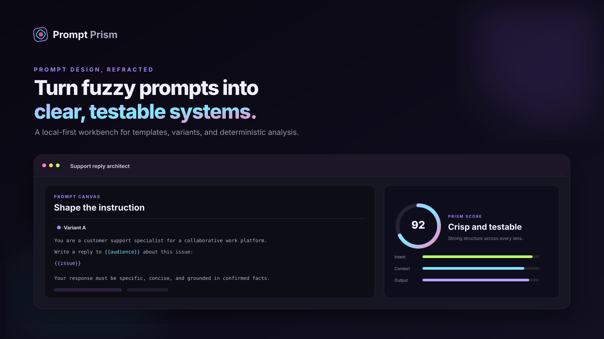
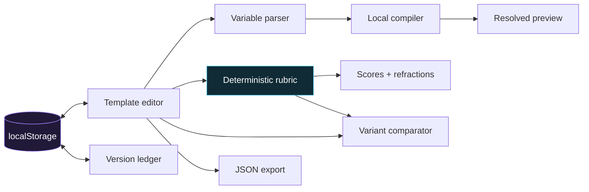

<div align="center">
  
  <br /><br />
  <h1>Prompt Prism</h1>
  <p><strong>Design prompts as systems—not strings.</strong></p>
  <p>A polished, local-first workbench for prompt templates, variables, variants, transparent heuristics, and versioned experimentation.</p>
  <p>
    
    
    
    
  </p>
</div>

> **Important:** Prompt Prism does not call an LLM. Its analysis is a deterministic, inspectable browser-side rubric. It helps shape and compare prompt designs; it does not measure real model performance.

## The problem

Prompts often live in chat histories and text files, where variables are implicit, revisions are easy to lose, and “looks good” becomes the only quality check. Prompt Prism makes prompt design tangible: compile a template against sample data, compare two approaches, inspect why a rubric score changed, and capture deliberate milestones.

## What it can do

- **Compile live templates** from `{{named_variables}}`, with automatic input discovery and unresolved-value signaling.
- **Compare challenger variants** side by side, including score and word-count deltas.
- **Explain its analysis** across intent, context, constraints, output design, and guardrails.
- **Suggest concrete refinements** from deterministic keyword, structure, and length checks.
- **Capture and restore versions** with local timestamps and rubric scores.
- **Export the workspace** as portable JSON, including variants, values, and analysis.
- **Start from useful patterns** for support, research synthesis, and design critique.
- **Respect the browser** with responsive layouts, keyboard navigation, reduced-motion support, and local persistence.

## Architecture



Everything runs in one browser tab. `app.js` owns the state model, template compiler, heuristic evaluator, version ledger, and exports; `styles.css` provides the responsive visual system.

## Quick start

No install and no build step are required.

```bash
git clone https://github.com/harshareddy0405/prompt-prism.git
cd 02-prompt-prism
python3 -m http.server 8080
```

Open [http://localhost:8080](http://localhost:8080). You can also open `index.html` directly, though a local server gives the most consistent browser behavior.

## Usage

1. Choose a starting point or clear the canvas.
2. Write a prompt and add placeholders such as `{{audience}}` or `{{source}}`.
3. Fill the generated variable inputs and open **Preview** to inspect the compiled result.
4. Review the five analysis lenses and their suggested “refractions.”
5. Create a different approach in **Variant B**, then choose **Compare**.
6. Save meaningful milestones to the version ledger; export the finished workspace as JSON.

Keyboard shortcuts:

| Shortcut                             | Action                  |
| ------------------------------------ | ----------------------- |
| <kbd>⌘/Ctrl</kbd> + <kbd>Enter</kbd> | Refresh analysis        |
| <kbd>⌘/Ctrl</kbd> + <kbd>S</kbd>     | Save a version          |
| <kbd>Esc</kbd>                       | Close the rename dialog |

## How the score works

The evaluator searches for visible, testable signals. It combines direct action verbs, context language, explicit boundaries, output-shape instructions, uncertainty handling, document structure, variable use, and prompt length. Each lens is capped at 100 and combined with fixed weights.

This rubric is deliberately modest. It can identify missing structure; it cannot know whether a prompt is correct for a domain or whether a real model will respond reliably.

## Project structure

```text
02-prompt-prism/
├── assets/
│   └── cover.svg       # Repository hero artwork
├── app.js              # State, compiler, rubric, versions, exports
├── index.html          # Accessible application shell
├── styles.css          # Responsive design system
├── README.md
├── LICENSE
└── .gitignore
```

## Local-first & privacy

- Prompt text, variables, and versions are stored in your browser's `localStorage`.
- No analytics, cookies, external SDKs, API keys, model endpoints, or network calls are used by the app.
- Export happens through a browser-generated file.
- Clearing site data removes the saved workspace. Export anything you need to keep.

## Roadmap

- [ ] Import previously exported workspaces
- [ ] Named experiment suites with expected-output assertions
- [ ] Sentence-level variant diff highlighting
- [ ] Customizable rubric weights and organization rules
- [ ] Shareable, encrypted workspace bundles
- [ ] Optional adapter interface for user-supplied evaluation backends

## Contributing

Thoughtful issues and pull requests are welcome. Keep the default experience dependency-free and local-first. For evaluator changes, include an example showing the same input produces the same result. For visual changes, check keyboard access, contrast, and mobile layouts.

1. Fork the repository and create a focused branch.
2. Serve the project locally and make the change.
3. Test the editor, preview, comparison, version restore, and export flows.
4. Open a pull request describing the behavior and design rationale.

## License

Released under the [MIT License](LICENSE).

## Built to be inspected

[](https://github.com/harshareddy0405/prompt-prism/actions/workflows/ci.yml)

The project includes versioned source, guarded local persistence, malformed-data recovery, product-specific interaction tests, and automated accessibility semantics checks. No API key is required to explore it.

```bash
# Optional development checks; the app itself needs no installation
npm ci --ignore-scripts
npm run check
npm test
npm run format:check
```

[Engineering notes](docs/ENGINEERING.md) · [Contributing](CONTRIBUTING.md) · [Security & privacy](SECURITY.md)

**Scope:** Quality scores are transparent writing heuristics. They do not measure a model's factuality or task success.
